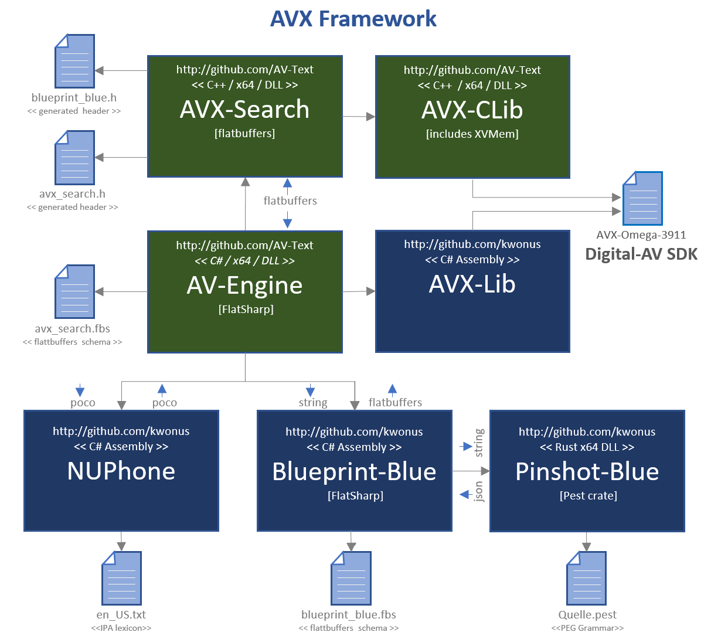
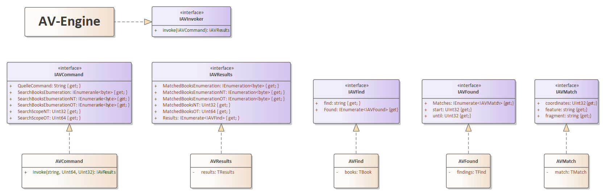
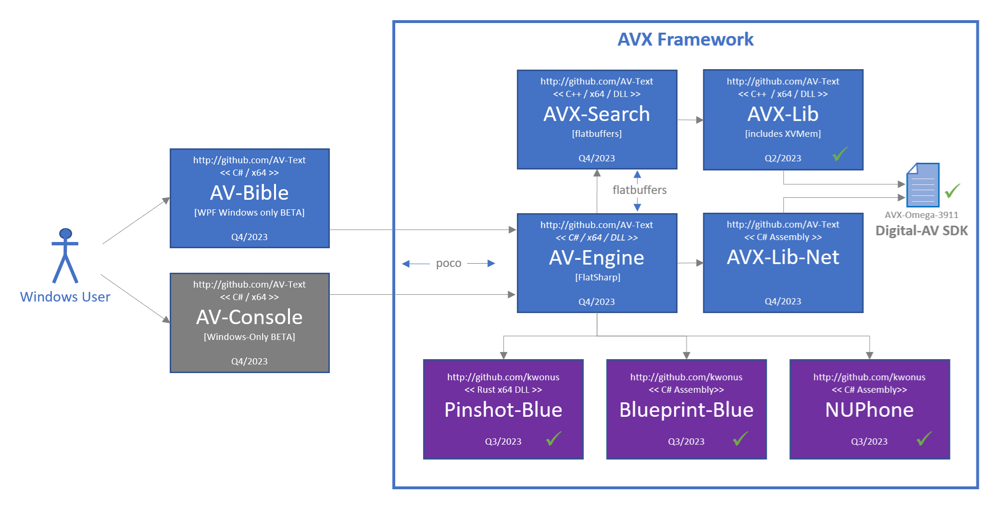
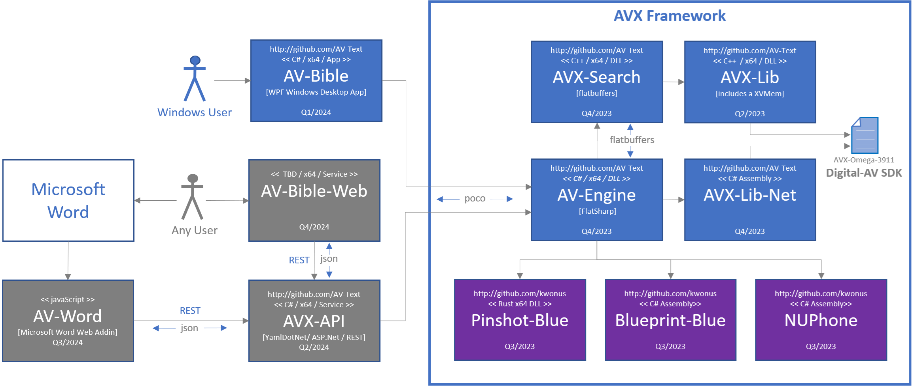

# AVX Framework

- a fork of https://github.com/kwonus/Digital-AV

### Introduction

It's been a quarter century since the first release of AV-Bible for Windows. In its day, it was the world's first <u>free</u> bible software with a graphical user interface that ran on Microsoft Windows. It was originally released as: AV-1995, AV-1996, ... , until the final releases as AV-2008 & AV-2011. A companion software development kit (SDK) emerged along side AV-2008 and AV-2011. The SDK was renamed "Digital-AV" not long after its initial debut. Over the years, I developed a few freeware products on top of it. None were ever as significant as AV-Bible. The AV-Bible application name was resurrected in 2021 as a WPF application using the Z-Series edition of the Digital-AV SDK. It is, has been, and always will be: free. 

With respect to the Digital-AV, you can rely on its foundation. With countless deployments and extensive text validation, Digital-AV has travelled the world and back with feedback from Christian missionaries, pastors, and lay people. They used it in their ministries. In return, I received treasured quality-control feedback. By 2008, all of the textual bugs were ironed out. Not coincidentally, 2008 was the first release of the SDK. Never making a dime, and pouring a healthy chunk of my life into this effort: it has been a labor of love.

AVX-Framework represents a radical step forward, at the same time as it reaches back to its roots. It began in the nineties as a fast & lean KJV search tool for Windows.  This modern framework, forked from Digital-AV, is still fast & lean. They say, "The more things change, the more things stay the same." This cliche applies here. In its first incarnation, AV-Bible GUI was walled off from an in-memory database in a C++ library named "AV-Engine". AV-Engine is back! While AV-Engine itself is now C#, the remaining framework is once again C++ (because it is fast and lean). As before, AV-Engine walls-off the AV-Bible GUI, hearkening back to days gone by. The return to C++ is the most substantial refactoring that has occurred in Digital-AV [and its family of products], for well over a decade. The magnitude of that effort was what led to the forking of the Digital-AV repo.  

### Core Functionality

AVX-Framework encodes the entire text of the bible, including Strong's numbers, Lemmatizations, Part-of-Speech tags, named-entity types, and [NUPhone representation](https://github.com/kwonus/NUPhone/blob/main/NUPhone.md). The updated Digital-AV Omega release packs all of this information into a compact binary file, indexed, with a fully documented format. Prior to AVX-Framework, Digital-AV never really had a seperate and complete reference implementation. AVX-Framework fills that void: AV-Engine is the entry-point to the framework. The codebase of AVX-Framework augments AVX-Lib from the baseline repo, but even that library has updated features. AVX-Framework adds new core functionality:

- sounds-alike searching via the NUPhone assembly
- ability to precisely render text, with metadata from search for matches to accommodate term-highlighting
- complete support for dual lexicons 
- rich command/search language via the Pinshot-Blue library and its PEG grammar, conforming to the [Quelle specification](https://github.com/kwonus/Quelle/blob/main/Quelle-AVX.md).
- object-model representations of AVX dialect of the Quelle grammar via the Blueprint-Blue library
- AV-Engine library glues it all together (also exposing public methods and objects from NUPhone, AVX-Lib-Net, and the Blueprint-Blue object model)

### Deeper Context

At the time of the initial fork, many features that define "AVX-Framework", were just an experiment. I am happy to report that the experiment is a success! Incidentally, AVX is an abbreviation for **AV** e**X**tensions; AV itself is an abbreviation for **A**uthorized **V**ersion. The Authorized Version is the more proper name for the King James Bible. It is called that because it was <u>authorized</u> by the king (This is super significant in history: because prior to its authorization, it was illegal in England to publish an English translation of the scriptures, and punishable by death).

AVX-Framework offers unparalleled linguistic-search capabilities for the sacred text. Its fidelity of expression exceeds that found in most search-engines and command-languages. Notwithstanding, AVX-Framework is quintessentially a digital representation of the AV bible at its core, albeit offering more than mere render and search capabilities. Underneath the text, it models a broad range of linguistic features. The grammar defined by Quelle-AVX is concise, intuitive, and useful. By implementing the Quelle-AVX grammar specification v2.0.3.901, the framework extends the Digital-AV [Omega-series SDK](https://github.com/AV-Text/AVX/blob/master/omega/Digital-AV-Ω39.pdf) to enable sounds-alike searching. The new framework even provides equivalence-mapping to Elizabethan-English counterparts for all supplied modern-English search terms (Of note: AV text is written in Elizabethan-English, sometimes called "Early Modern English". King James commissioned 47 translators of world renown. Contemporaries of Shakespeare, these 47 translators clearly identified their objective: "... ***to make GODS holy Trueth to be yet more and more knowen unto the people*** ..."  (in their own words, found in the introduction to the Authorized Version of 1611).

We at AV-Text Ministries have adopted their objective. Four centuries later, it resonoates with us as if it had been spoken only yesterday. We recognize that this is a lofty goal, but we wholeheartedly embrace it! AVX-Framework is optimized for searching the sacred text, even with sounds-alike string-matching. Quelle-AVX is just as intuitive for the novice as someone with expert language skills. It allows the user to stay primitive, or search with deep nuances of language. It finds bible verses, whether queries be simple or complex. Leveraging our framework, developers are empowered by a powerful and intuitive command language. If that were not enough, the Digital-AV is a manifestation of the most trustworthy English text that God has yet availed to mankind [The Authorized Version of 1611, with standardized spelling revisions of the 1769 edition]. Developers can concentrate on specific needs for various users and personas. Our license is designed to be as free as the gospel. Use it as you see fit, hopefully to the glory of God. The 2024 release of AV-Bible will be the first application built on top of AVX-Framework.

### Modular Framework with Minimal Dependencies

There are three external dependencies of AVX-Framework: DotNet, FlatBuffers, and FlatSharp. All of these are cross-platform and open-source. They were chosen for there speed, ubiquity, efficiency, and their liberal licenses. Together, they allow for efficient communication between C# and C++ modules. Of course, there are internal dependencies; those also are all open source (maintained by AV Text Ministries; found at https://github.com/kwonus and https://github.com/AV-Text/AVX).  

The latest architecture is highly modular. Earlier works were much more monolithic. While monolithic applications can be built faster, they are more fragile, difficult to refactor, and exhibit maintenance issues over the long haul. While a modular architecture is more labor-intensive initially, it's way easier to refactor. Modularity facilitates incremental improvements that can be accomplished in shorter timeframes. In other words, it takes longer on the onset, but it's way better over time.

Consumers of AVX-Framework directly target a single dotnet assembly, namely AV-Engine. However, additional publicly available classes are exposed in AVX-Lib-Net and NUPhone, and AV-Engine consumers can reach into those two modules. The other dependencies are mostly opaque. The seven modules that compose the framework, along with file dependencies, are depicted in Figure-1 below:

**Figure-1**: AVX-Framework dependency diagram [revision #3B01]

Evidenced by Figure-1, serialization is used for parameters when crossing language-boundaries. Parameter serialization, for in-proc cross-language invocation, is used in lieu more granular parameter-marshalling, because it is both more efficient and less fragile than marshalling. In-proc method invocations that do <u>not</u> cross language boundaries utilize POCO (plain old C# objects \<or\> plain old C++ objects). The table in Figure 2 identifies serialization formats used for inputs and outputs per module, along with repository references.

| **Module**  *(repository)* source code folder            | **Input**                                                    | **Output**                                                   |
| ------------------------------------------------------------ | ------------------------------------------------------------ | ------------------------------------------------------------ |
| **AV-Engine** *(github.com/AV-Text/AVX)* [./AV-Engine](https://github.com/AV-Text/AVX/tree/master/AV-Engine) | Quelle Command (text)                                        | IAVResult   interface                                        |
| **AVX-Search** *(github.com/AV-Text/AVX)* [./AVXSearch](https://github.com/AV-Text/AVX/tree/master/AVXSearch) | flatbuffers binary [blueprint] *(schema: blueprint_blue.fbs)* | flatbuffers binary [search results] *(schema: avx_search.fbs)* |
| **AVX-Lib** *(github.com/AV-Text/AVX)* [./AVXLib](https://github.com/AV-Text/AVX/tree/master/AVXLib) | C++ Classes/Methods                                          | C++ Classes/Methods                                          |
| **Digital-AV** *(github.com/AV-Text/AVX)* [./omega](https://github.com/AV-Text/AVX/tree/master/omega)/AVX-Omega-3911.data | n/a                                                          | *see specification:* [Digital-AV-Ω39.pdf](https://github.com/AV-Text/AVX/blob/master/omega/Digital-AV-Ω39.pdf) |
| **AVX-Lib-Net** *(github.com/kwonus/Digital-AV)* [./omega/foundations/csharp/AVXLib](https://github.com/kwonus/Digital-AV/tree/master/omega/foundations/csharp/AVXLib) | C# Classes/Methods                                           | C# Classes/Methods                                           |
| **Pinshot-Blue** *(github.com/kwonus/pinshot-blue)* [./src](https://github.com/kwonus/pinshot-blue/tree/main/src) | null-terminated text                                         | json-formatted text [pinshot] *(null-terminated text)*   |
| **Blueprint-Blue** *(github.com/kwonus/blueprint-blue)* [./Blueprint-Blue-Lib](https://github.com/kwonus/blueprint-blue/tree/main/Blueprint-Blue-Lib) | null-terminated text                                         | flatbuffers binary [blueprint] *(schema: blueprint_blue.fbs)* |
| **NUPhone** *(github.com/kwonus/NUPhone)* [./PhonemeEmbeddings](https://github.com/kwonus/NUPhone) | C# Classes/Methods                                           | C# Classes/Methods                                           |

**Figure-2**: AVX-Framework input and output definition and repository details [revision #3B01]

### AV-Engine Internals

As depicted in Figure 3, AV-Engine is called in-proc by its consumers. It uses standard C# interfaces for the parameter and the return type in its single exposed public class method. The diagram depicts dependent interfaces and internal utility-class definitions. Consumers will have full visibility across these public interfaces, but the underlying internal utility classes do all the work. In effect, each internal class manifests a fascade that encapsulates away any remants of the FlatSharp API (with respect to AV-Engine/AVX-Framework consumers). Nevertheless, close examination of avx_search.fbs schema, reveals that the IAVResults interface is a very thin wrapper around the XResults FlatSharp-generated object.

**Figure-3**: Plain Old C# Objects (POCO) are used in the interface to AV-Engine

### Development Roadmap

A BETA release of AV-Bible and AV-Console are planned for 2023. The development roadmap for 2023 is depicted in Figure-4.

**Figure-4**: Development roadmap for BETA releases in 2023 [revision #3B01]

We plan to harden AV-Bible (Windows desktop application) and release it into the Microsoft Store in the first quarter of 2024. Afterwards, additional apps will be implemented and released. The diagram, depicted in Figure-5, identifies anticipated application releases and estimated release dates:

**Figure-5**: Roadmap for [user-facing] application releases in 2024 [revision #3B01]

### Implementation Status

Most of the green boxes, in the diagram, are in active development. Planned completion dates are identified above. Any box with a checkmark is already complete. Work will commence on the dark-gray boxes some time after AV-Bible is updated in the Microsoft Store.  It's helpful to have this pic as a roadmap. As you can see, AVX-Framework is a core dependency for all apps.

All source-code for the green boxes can be found [in this repo](https://github.com/AV-Text/AVX). Source-code for the blue boxes can be found in my [companion repos](https://github.com/kwonus) at https://github.com/kwonus.

The AV-Bible application is [currently available](https://apps.microsoft.com/detail/9NN9X59QTZ3J?gl=US&hl=en-us) in the Microsoft Store. The existing app is being retrofitted to utilize the native C++ library implementations in this forthcoming framework. With this new framework, AV-Bible will expose dozens of new features and capabilities. And to be honest, the feature set of the existing app is a bit limited (as it sports an older SDK, and an earlier, v1-alpha release of Quelle).

Your feedback on this framework is welcome!

**The Lord gave the word: great was the company of those that published it. -- Psalm 68:11**
