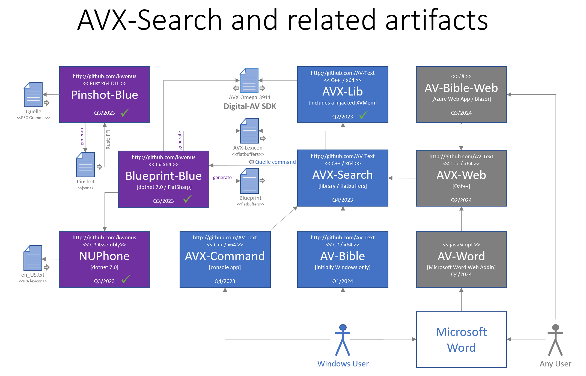

# AVX Search

- a fork of https://github/kwonus/Digital-AV

It's been over twenty-five years since the release of AV-Bible for Windows (also known as AV-1995). In its day, it was the first free bible software with a graphical user interface that ran on Microsoft Windows. This "Freeware" was maintained for a decade and a half (AV-1996, AV-1997, ..., AV-2011). Eventually, it evolved into a software development kit (SDK). Accordingly, it was renamed Digital-AV some years ago.

You can rely on its foundation, with decades of deployments and text validation. Digital-AV has travelled the world and back with feedback from Christian missionaries. They used it in their ministries. In return, I received treasured quality-control feedback. By 2008, all of the textual bugs had been ironed out. Not coincidentally, 2008 was the first release of the SDK. Never making a dime, and pouring a healthy chuck of my life into it: this has been a labor of love.

AVX-Search represents a radical step forward at the same time as it reaches back to its roots as the fastest and most compact search tool for the KJV text. This fork from Digital-AV assembles all the pieces into a whole.

The Digital-AV SDK is a single 19mb file that can be used to manifest the entire text of the bible, including Strong's numbers, Lemmatizations, Part-of-Speech tags, and other linguistic features. But even with all of that, it's still the KJV Bible at the core. AVX-Search utilizes the C++ foundations of that SDK. Coupling that with some open source parsing engines, results in a fast and efficient search engine with a minimal set of dependencies. Upon this, is built user-facing applications

One dependency that is rolled in here is FlatBuffers, due to its speed, compactness, and ubiquity.

The other dependencies are open source projects, produced and managed by AV Text Ministries. [https://github/kwonus]

How they relate to AVX-Search is depicted in this diagram:

The blue boxes above are all in active development. As such, end-user apps are not yet available. They are expected to be completed in 2023. After that, status will be evaluated and work can commence on the gray boxes.  Still it's helpful to have this pic as a roadmap. As you can see, AVX-Search is a central dependency for downstream user-facing apps. Some architectural decisions mitigate a recent surprising discovery: dotnet apps are unable to perform interop with x64 C++ libraries via P/Invoke. Accordingly, the revised architecture diminishes the overall presence of dotnet. For additional details, head on over to  https://github/kwonus, and browse the repositories there.

The Lord gave the word: great was the company of those that published it. -- Psalm 68:11
