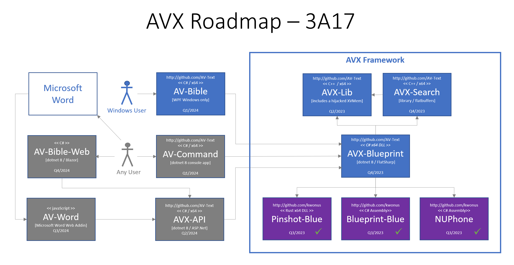

# AVX Framework

- a fork of https://github/kwonus/Digital-AV

It's been a quarter century since the first release of AV-Bible for Windows. In its day, it was the world's first <u>free</u> bible software with a graphical user interface that ran on Microsoft Windows. Originally conceived in 1992, this "Freeware" was maintained until 2011 and released as: AV-1995, AV-1996, AV-1997, ... , AV-2011. Eventually, it evolved into a software development kit (SDK). Accordingly, that SDK was renamed Digital-AV over a decade ago.

With respect to the Digital-AV, you can rely on its foundation. With countless deployments and extensive text validation, Digital-AV has travelled the world and back with feedback from Christian missionaries, pastors, and lay people. They used it in their ministries. In return, I received treasured quality-control feedback. By 2008, all of the textual bugs were ironed out. Not coincidentally, 2008 was the first release of the SDK. Never making a dime, and pouring a healthy chunk of my life into this effort: this has been a labor of love.

AVX-Search represents a radical step forward at the same time as it reaches back to its roots as the fastest and most compact search tool for the KJV text. This fork from Digital-AV assembles all the pieces, conveniently in a single github repo.

The Digital-AV manifests the entire text of the bible, including Strong's numbers, Lemmatizations, Part-of-Speech tags, and other linguistic features into a single compactly formatted binary file. Notwithstanding, it is the KJV Bible at its core. Within this repo can be found the upgraded AVX-Omega-3911 data file that addresses a bug discovered in the previous Digital-AV Omega release. Bundling AVX assets into a dotnet-accessible framework not only streamlines development, but it also produces a fast and efficient search engine. It is fully optimized for searching the sacred text. Even fuzzy string matching is available, for the creation of rich, user-facing applications.

There is only one external dependency of AVX-Search/AVX-Framework: that is FlatBuffers. It was selected for its speed, compactness, ubiquity, and its liberal license. It is used for communication with the Blueprint-Blue parser/server.

Of course, there are several internal dependencies. These are all open source projects the liberal licensing, produced and managed by AV Text Ministries [https://github/kwonus]. There was no need to fork these other dependencies [purple boxes below]; these are already complete and readily available. 

The latest architecture is highly modularized. Earlier works by me were much more monolithic. While monolithic applications can be built faster, they are far more fragile, difficult to refactor, and exhibit insurmountable maintenance issues over the long haul. While a microservice architecture is more hourly intensive year-by-year, it's way easier to pivot to better solutions without having to surgically remove deep dependencies. In other words, it takes longer, but it's far better.

AV Text ministries hopes that you find assets here that can assist you in building next-gen, quality applications using the most trustworthy English text that God has ever availed to mankind [The Authorized Version 1769 text, commonly known as the King James Bible]. The license is designed to be as free as the gospel. Use it as you see fit, hopefully to the glory of God.

How each dependent service and library are interwoven into the AVX Framework is depicted below:

The user facing applications built upon this framework are depicted relative to AVX-Framework in this diagram:

The blue boxes above are all in active development with the planned completion identified in the diagram; All of these can be found in this [AVX] repo. The purple boxes are already complete from a developer perspective. However, they still need to be packaged for deployment.  End-user apps are unavailable at this time. They are expected to become available in late 2023 or early in 2024. After that, status will be evaluated and work can commence on the gray boxes.  It's helpful to have this pic as a roadmap. As you can see, AVX-Framework is a core dependency for all user-facing apps. For additional info on the purple boxes and Digital-AV, head on over to  https://github.com/kwonus, and browse the repos there.

The AV-Bible application name was recently resurrected as a C# WPF application (available at the Windows Store as a free app). The current plan is to revitalize the existing WPF by augmenting it with fast native C++ library implementations.

The Lord gave the word: great was the company of those that published it. -- Psalm 68:11
