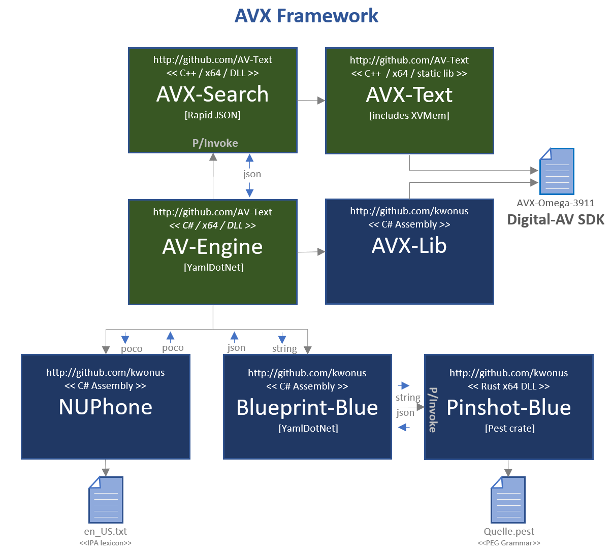
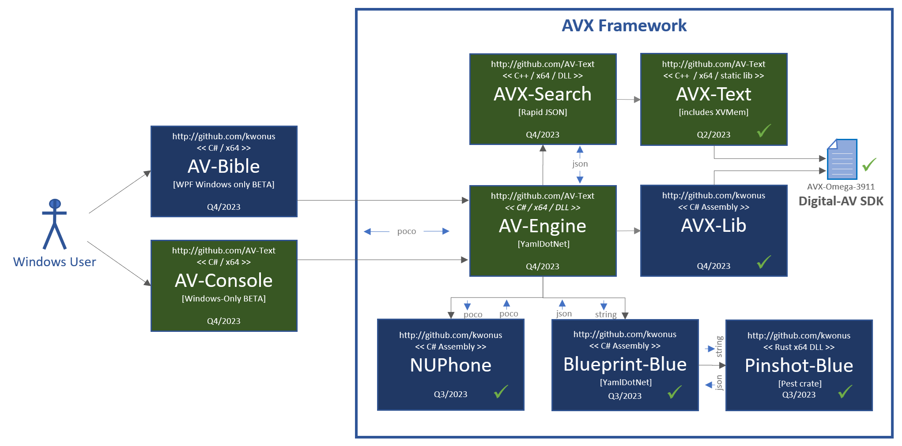

# AVX Framework

- a fork of https://github.com/kwonus/Digital-AV

It's been a quarter century since the first release of AV-Bible for Windows. In its day, it was the world's first <u>free</u> bible software with a graphical user interface that ran on Microsoft Windows. Originally conceived in 1992, this "Freeware" was maintained until 2011 and released as: AV-1995, AV-1996, AV-1997, ... , AV-2011. Eventually, it evolved into a software development kit (SDK). Accordingly, that SDK was renamed Digital-AV over a decade ago.

With respect to the Digital-AV, you can rely on its foundation. With countless deployments and extensive text validation, Digital-AV has travelled the world and back with feedback from Christian missionaries, pastors, and lay people. They used it in their ministries. In return, I received treasured quality-control feedback. By 2008, all of the textual bugs were ironed out. Not coincidentally, 2008 was the first release of the SDK. Never making a dime, and pouring a healthy chunk of my life into this effort: this has been a labor of love.

AVX-Framework represents a radical step forward at the same time as it reaches back to its roots as the fastest and most compact search tool for the KJV text. This fork from Digital-AV assembles the first release of a collection of libraries that we have labelled AVX-Framework. All of the new artifacts are assembled right here in a single repo. Those artifacts that cannot be found here are available in a centralized location: http://github.com/kwonus . They say, "The more things change, the more things stay the same." This cliche applies here. Before the turn of the century, a Borland Delphi GUI was walled off from the \[in-proc\] back-end, witten in C++ and called "AV-Engine". Eventually AV-Engine sported an HTTP REST-like interface. AV-Engine is back! While it is now a C# implementation, much of AVX-Framework is now C++ to keep it lean and to maximamize performance. This transition back away from a fully C# DotNet implementation is the most substantial refactoring that has occurred for well over a decade. The magnitude of that effort was what led me to fork the baseline Digital-AV repo.

The AVX-Framework manifests the entire text of the bible, including Strong's numbers, Lemmatizations, Part-of-Speech tags, and other linguistic features into a single compactly formatted binary file. AVX-Framework improves Digital-AV, by adding sounds-alike searching with NUPhone and full integration with the Blueprint-Blue object model and the Pinshot-Blue grammar for rich search syntax and control. This offers search controls that rival any modern search engine with a concise syntax. Notwithstanding, it is the KJV Bible at its core. Herein, you can find the upgraded AVX-Omega-3911 data file (an upgrade to Digital-AV Omega baseline release). Bundling AVX assets into a dotnet-accessible framework produces a fast and efficient search engine, while streamlining the implementation. In this fork of Digital-AV, the AVX-Framework centralizes access via the new AV-Engine assembly (see diagrams below). In short, AVX-Framework is optimized for searching the sacred text, even with fuzzy sounds-alike string-matching, enabling the creation of rich user-facing applications.  

There is only one external dependency of AVX-Framework: that is FlatBuffers. It was selected for its speed, compactness, ubiquity, and its liberal license. It is used for communication with the Blueprint-Blue parser/library.

Of course, there are internal dependencies; these are open source projects, produced and maintained by AV Text Ministries, found at https://github.com/kwonus and https://github.com/AV-Text/AVX . 

The latest architecture is highly modularized. Earlier works were much more monolithic. While monolithic applications can be built faster, they are more fragile, difficult to refactor, and exhibit maintenance issues over the long haul. While a modular architecture is more labor-intensive year-by-year, it's way easier to refactor. Modularity facilitates incremental improvements that can be accomplished in shorter timeframes. In other words, it takes longer on the onset, but it's way better over time.

AV Text ministries hopes that you find assets here that can assist you in building next-gen, quality applications using the most trustworthy English text that God has yet availed to mankind [The Authorized Version 1769 text, commonly known as the King James Bible]. The Digital-AV license is designed to be as free as the gospel. Use it as you see fit, hopefully to the glory of God.

Consumers of AVX-Framework directly target a single dotnet assembly, namely AV-Engine. However, many publicly available classes are exposed in AVX-Lib-Net and NUPhone. It is possible for AV-Engine consumers to reach into those two modules, but the other dependencies are mostly opaque. The seven modules that compose the framework are depicted in Figure-1, also exposing all embedded file dependencies:

**Figure-1**: AVX-Framework dependency diagram [revision #3A24]

Implicit in Figure-1, serialization is used for parameters when crossing language-boundaries. Parameter serialization, for in-proc cross-language invocation, is used in lieu more-granular parameter marshalling, because it both more efficiant and less fragile than marshalling. In-proc method invocations that do <u>not</u> cross language boundaries utilize POCO (plain old C# objects \<or\> plain old C++ objects). The table in Figure 2 identifies serialization formats used for inputs and outputs per module, along with repository information.

| **Module**  *(repository)* source code folder            | **Input**                                                    | **Output**                                                   |
| ------------------------------------------------------------ | ------------------------------------------------------------ | ------------------------------------------------------------ |
| **AV-Engine** *(github.com/AV-Text/AVX)* ./AV-Engine     | Quelle Command (text)                                        | IAVResult   interface                                        |
| **AVX-Search** *(github.com/AV-Text/AVX)* ./AVX-Search   | flatbuffers binary [blueprint] *(schema: blueprint_blue.fbs)* | flatbuffers binary [search results] *(schema: avx_search.fbs)* |
| **AVX-Lib** *(github.com/AV-Text/AVX)* ./AVX-Lib         | C++ Classes/Methods                                          | C++ Classes/Methods                                          |
| **Digital-AV** *(github.com/AV-Text/AVX)* ./omega/AVX-Omega-3911.data | n/a                                                          | *see specification:* [Digital-AV-Ω39.pdf](https://github.com/AV-Text/AVX/blob/master/omega/Digital-AV-Ω39.pdf) |
| **AVX-Lib-Net** *(github.com/kwonus/Digital-AV)* ./omega/foundations/csharp/AVXLib | C# Classes/Methods                                           | C# Classes/Methods                                           |
| **Pinshot-Blue** *(github.com/kwonus)* ./src             | null-terminated text                                         | json-formatted text [pinshot] *(null-terminated text)*                  |
| **Blueprint-Blue** *(github.com/kwonus/blueprint-blue)* ./Blueprint-Blue-Lib | null-terminated text                                         | flatbuffers binary [blueprint] *(schema: blueprint_blue.fbs)* |
| **NUPhone** *(github.com/kwonus/NUPhone)* ./PhonemeEmbeddings | C# Classes/Methods                                           | C# Classes/Methods                                           |

**Figure-2**: AVX-Framework input and output definition and repository details [revision #3A24]

AV-Engine, as a C# library uses standard C# interfaces for parameters and return type in its single explosed class method, as depicted in Figure 3. The class diagram also depicts details of the inface objects.  Private members of the classes, that implement these interfaces, are instantiated by AV-Engine. In effect, each class manfifests a fascade that encapsulates away all details of the FlatSharp interface from AV-Engine consumers. However, upon close examination of avx_search.fbs, the flatbuffers schema defined in AV-Engine, it is clear that the IAVResults interface is it is a very thin facade over XResults.

**Figure-3**: Plain Old C# Objects (POCO) are used in the interface to AV-Engine

A BETA release of AV-Bible and AV-Console are planned for 2023. The development roadmap for 2023 is depicted in Figure-4.

**Figure-4**: Development roadmap for BETA releases in 2023 [revision #3A24]

We plan to harden AV-Bible (Windows desktop application) and release it into the Windows Store in the first quarter of 2024. Afterwards, additional apps will be implemented and released. The diagram, depicted in Figure-5, identifies anticipated application releases and estimated release dates:

**Figure-5**: Roadmap for [user-facing] application releases in 2024 [revision #3A24]

Most of he blue boxes, in the diagram, are being actively developed. Planned completion dates are identified. All source-code for these can be found in this [AVX] repo. The purple boxes are already complete. Work will commence on the gray boxes some time after the release of AV-Bible to the Windows Store.  It's helpful to have this pic as a roadmap. As you can see, AVX-Framework is a core dependency for all apps. For additional info on the purple boxes and the Digital-AV SDK, head on over to my other repos at  https://github.com/kwonus.

The AV-Bible application is currently available at the Windows Store as a free app. The existing app is being retrofitted to utilize the native C++ library implementations in the forthcoming AVX-Framework.  By incorporating the new framework into AV-Bible, there will be dozens of new features and capabilities.

**The Lord gave the word: great was the company of those that published it. -- Psalm 68:11**
