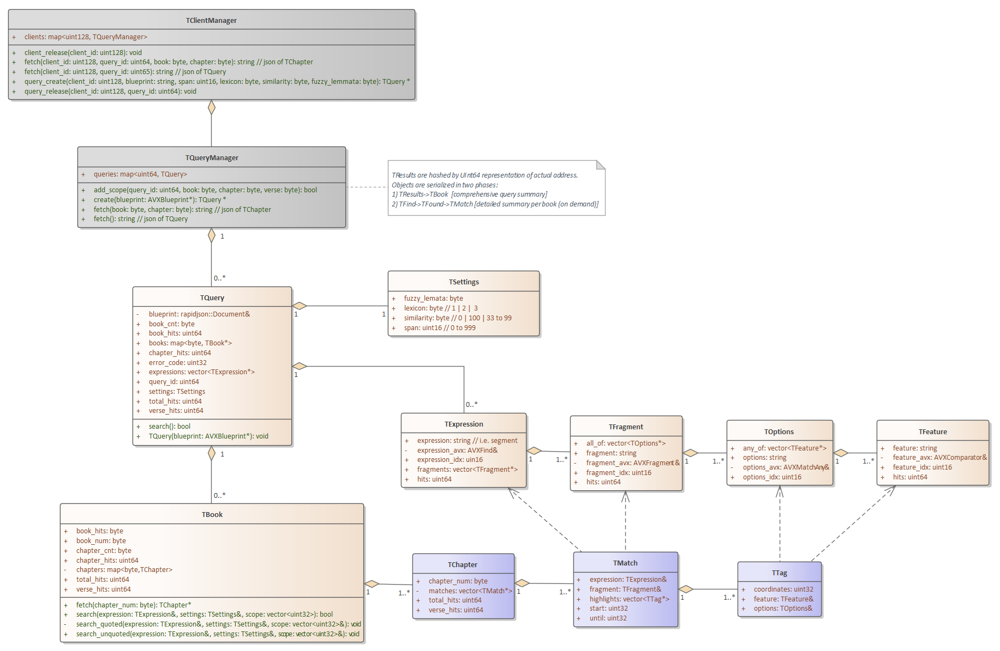
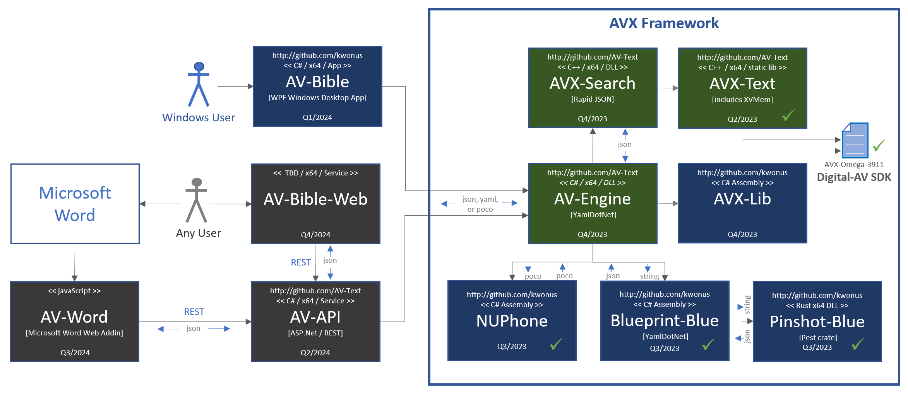

# AVX Framework

- a fork of https://github.com/kwonus/Digital-AV

### Introduction

It's been a quarter century since the first release of AV-Bible for Windows. In its day, it was the world's first <u>free</u> bible software with a graphical user interface that ran on Microsoft Windows. It was originally released as: AV-1995, AV-1996, ... , until the final releases as AV-2008 & AV-2011. A companion software development kit (SDK) emerged along side AV-2008 and AV-2011. The SDK was renamed "Digital-AV" not long after its initial debut. Over the years, I developed a few freeware products on top of it. None were ever as significant as AV-Bible. The AV-Bible application name was resurrected in 2021 as a WPF application, built with the Digital-AV SDK. It is, has been, and always will be: free. 

With respect to the Digital-AV, you can rely on its foundation. With countless deployments and extensive text validation, Digital-AV has travelled the world and back with feedback from Christian missionaries, pastors, and lay people. They used it in their ministries. In return, I received treasured quality-control feedback. By 2008, all of the textual bugs were ironed out. Not coincidentally, 2008 was the first release of the SDK. Never making a dime, and pouring a healthy chunk of my life into this effort: it has been a labor of love.

AVX-Framework represents a radical step forward, at the same time as it reaches back to its roots. It began in the nineties as a fast & lean KJV search tool for Windows.  This modern framework, forked from Digital-AV, is still fast & lean. They say, "The more things change, the more things stay the same." This cliche applies here. In its first incarnation, AV-Bible GUI was walled off from an in-memory database in a C++ library named "AV-Engine". AV-Engine is back! Once again, it walls-off the GUI apps from the processing engine itself. While the engine is now Dotnet, most of the framework is C++. The return to C++, and the formalization of AVX-Framework, is the most substantial refactoring of Digital-AV since its original inception. The magnitude of that effort was what led to the forking of the Digital-AV repo.  

### Core Functionality

AVX-Framework encodes the entire text of the bible, including Strong's numbers, Lemmatizations, Part-of-Speech tags, named-entity types, and [NUPhone representation](https://github.com/kwonus/NUPhone/blob/main/NUPhone.md). The updated Digital-AV Omega release packs all of this information into a compact binary file, indexed, with a fully documented format. Prior to AVX-Framework, Digital-AV never really had a seperate and complete reference implementation. AVX-Framework fills that void: AV-Engine is the entry-point to the framework. The codebase of AVX-Framework augments AVX-Lib from the baseline repo, but even that library has updated features. AVX-Framework adds new core functionality:

- sounds-alike searching via NUPhone Representation and the campanion NUPhone dotnet assembly
- ability to precisely render text, with metadata from search to accommodate term-highlighting of matched query tokens
- complete support for dual lexicons 
- rich command/search language via the Pinshot-Blue library and its PEG grammar, conforming to the [Quelle specification](https://github.com/kwonus/Quelle/blob/main/Quelle-AVX.md).
- object-model representations of AVX dialect of the Quelle grammar via the Blueprint-Blue library
- AV-Engine library glues it all together, while also exposing public methods of dependent dotnet assemblies

### Deeper Context

At the time of the initial fork, many features that define "AVX-Framework", were just an experiment. I am happy to report that the experiment succeded! Incidentally, AVX is an abbreviation for **AV** e**X**tensions; AV itself is an abbreviation for **A**uthorized **V**ersion. The Authorized Version is the more proper name for the King James Bible. It is called that because it was <u>authorized</u> by the king (This is super significant in history: because prior to its authorization, it was illegal in England to publish an English translation of the scriptures, and punishable by death).

AVX-Framework offers unparalleled linguistic-search capabilities for the sacred text. Its fidelity of expression exceeds that found in most search-engines and command-languages. Notwithstanding, AVX-Framework is quintessentially a digital representation of the AV bible at its core, albeit offering more than mere render and search capabilities. Underneath the text, it models a broad range of linguistic features. The grammar defined by Quelle-AVX is concise, intuitive, and useful. By implementing the Quelle-AVX grammar specification v2.0.3.901, the framework extends the Digital-AV [Omega-series SDK](https://github.com/AV-Text/AVX/blob/master/omega/Digital-AV-Ω39.pdf) to enable sounds-alike searching. The new framework even provides equivalence-mapping to Elizabethan-English counterparts for all supplied modern-English search terms (Of note: AV text is written in Elizabethan-English, sometimes called "Early Modern English". King James commissioned 47 translators of world renown. Contemporaries of Shakespeare, these 47 translators clearly identified their objective: "... ***to make GODS holy Trueth to be yet more and more knowen unto the people*** ..."  (in their own words, found in the introduction to the Authorized Version of 1611).

We at AV-Text Ministries have adopted their objective. Four centuries later, it resonoates with us as if it had been spoken only yesterday. We recognize that this is a lofty goal, but we wholeheartedly embrace it! AVX-Framework is optimized for searching the sacred text, even with sounds-alike string-matching. Quelle-AVX is just as intuitive for the novice as someone with expert language skills. It allows the user to stay primitive, or search with deep nuances of language. It finds bible verses, whether queries be simple or complex. Leveraging our framework, developers are empowered by a powerful and intuitive command language. If that were not enough, the Digital-AV is a manifestation of the most trustworthy English text that God has yet availed to mankind [The Authorized Version of 1611, with standardized spelling revisions of the 1769 edition]. Developers can concentrate on specific needs for various users and personas. Our license is designed to be as free as the gospel. Use it as you see fit, hopefully to the glory of God. The 2024 release of AV-Bible will be the first application built atop AVX-Framework. Inspired by those before us, we want ***to make God's holy Truth to be yet more and more known!***

### Modular Framework with Minimal Dependencies

There are just a few external dependencies of AVX-Framework: DotNet with YamlDotNet, and C++ with Rapid JSON. Dotnet is was chosen as it is open-source and cross-platform. C++ was chosen for its ubiquity and speed. JSON was also chosen for its ubiquity. YamlDotNet was chosen for its ability to parse/generate both YAML <u>and</u> JSON, along with its liberal open source license. Rapid JSON was chosen for its maturity and liberal open source license. JSON and P/Invoke serve as the glue to facilitate efficient communication from C# to C++ and Rust. There are additional internal dependencies; those also are all open source (maintained by AV Text Ministries; located at https://github.com/kwonus and https://github.com/AV-Text/AVX).  

The latest architecture is highly modular. Earlier works were much more monolithic. While monolithic applications can be built faster, they are more fragile, difficult to refactor, and exhibit maintenance issues over the long haul. While a modular architecture is more labor-intensive initially, it's way easier to refactor. Modularity facilitates incremental improvements that can be accomplished in shorter timeframes. In other words, it takes longer on the onset, but it's way better over time. The downside of modularity is a more complicated build sequence. However, most of my user-base is constrained to the AV-Bible application (that application is pre-built and distributed as binaries on the Microsoft App Store. If you need help building sources, please ping me.

Consumers of AVX-Framework directly target a single dotnet assembly, namely AV-Engine. However, additional publicly available classes are exposed in AVX-Lib and NUPhone. Consequently, AV-Engine consumers can reach into public methods in those assemblies. The other dependencies are mostly opaque. The seven modules that compose the framework, along with file dependencies, are depicted in Figure 1 below:

**Figure 1**: AVX-Framework dependency diagram [revision #3C02]

Evidenced by Figure 1, serialization is used for parameters when crossing language-boundaries. Parameter serialization, for in-proc cross-language invocation, is used in lieu more granular parameter-marshalling, because it is both more efficient and less fragile than marshalling. In-proc method invocations that do <u>not</u> cross language boundaries utilize POCO (plain old C# objects \<or\> plain old C++ objects). The table in Figure 2 identifies serialization formats used for inputs and outputs per module, along with repository references.

| **Module**  *(repository)* source code folder            | **Input**                                                    | **Output**                                                   |
| ------------------------------------------------------------ | ------------------------------------------------------------ | ------------------------------------------------------------ |
| **AV-Engine** *(github.com/AV-Text/AVX)* [./AV-Engine](https://github.com/AV-Text/AVX/tree/master/AV-Engine) | Quelle Command (text)                                        | IAVResult   interface                                        |
| **AVX-Search** *(github.com/AV-Text/AVX)* [./AVXSearch](https://github.com/AV-Text/AVX/tree/master/AVXSearch) | json-formatted text [blueprint] *(null-terminated text)* | json-formatted text [results] *(null-terminated text)*   |
| **AVX-Text** *(github.com/AV-Text/AVX)* [./AVXText](https://github.com/AV-Text/AVX/tree/master/AVXText) | C++ Classes/Methods                                          | C++ Classes/Methods                                          |
| **Digital-AV** *(github.com/AV-Text/AVX)* [./omega](https://github.com/AV-Text/AVX/tree/master/omega)/AVX-Omega-3911.data | n/a                                                          | *see specification:* [Digital-AV-Ω39.pdf](https://github.com/AV-Text/AVX/blob/master/omega/Digital-AV-Ω39.pdf) |
| **AVX-Lib** *(github.com/kwonus/Digital-AV)* [./omega/foundations/csharp/AVXLib](https://github.com/kwonus/Digital-AV/tree/master/omega/foundations/csharp/AVXLib) | C# Classes/Methods                                           | C# Classes/Methods                                           |
| **Pinshot-Blue** *(github.com/kwonus/pinshot-blue)* [./src](https://github.com/kwonus/pinshot-blue/tree/main/src) | null-terminated text                                         | json-formatted text [pinshot] *(null-terminated text)*   |
| **Blueprint-Blue** *(github.com/kwonus/blueprint-blue)* [./Blueprint-Blue-Lib](https://github.com/kwonus/blueprint-blue/tree/main/Blueprint-Blue-Lib) | null-terminated text                                         | json-formatted text [blueprint] *(null-terminated text)* |
| **NUPhone** *(github.com/kwonus/NUPhone)* [./PhonemeEmbeddings](https://github.com/kwonus/NUPhone) | C# Classes/Methods                                           | C# Classes/Methods                                           |

**Figure 2**: AVX-Framework input and output definition and repository details [revision #3C02]

### Blueprint-Blue Internals

Blueprint-Blue is an in-process .NET 8 assembly. It uses standard C# interfaces for parameters and the return types. However, the assembly also obfuscates calls to a native Rust library to parse the specialized Quelle grammar into a JSON parse tree. The relationship to the [Rust] [Pinshot-blue library](https://github.com/kwonus/pinshot-blue) is shown in Figure 1. Once a parse tree [JSON text] is converted into the Blueprint-Blue object framework, it is returned to the AV-Engine for further processing. The OO model/blueprint is depicted in Figure 3-1.

**Figure 3-1**: The Blueprint-Blue object model (an OO Framework that represents a [Quelle](https://github.com/kwonus/Quelle/blob/main/Quelle-AVX.md) parse)

The QFind object depicted above is almost a framework in itself. Figure 3-2 provides a detailed view of the QFind hierarchy. It should be noted that AV-Engine handles all Quelle commands except QFind [find expressions] without assistance from AVX-Search or AVX-Text. However, search expressions serialize the QFind object into JSON and call AVX-Search to perform the actual search in C++ native code.

**Figure 3-2**: Detail of the QFind class of the Blueprint-Blue object model

### AVX-Search Internals

Effectively, the QFind object is deserialized into a TQuery object hierarchy, which preserves the blueprint objects into a structure that facilitates a phased approach to yielding a search summary and search results. The TQuery object hierarchy also simplifies  rendering and highlighting for downstream clients. There are exactly two phases for each query. AVX-Search returns JSON representations of TQuery in phase one.  AVX-Search returns JSON representations of TChapter hierarchies on demand per chapter. All calls from AV-Engine to AVX-Search are in-process via P/Invoke, utilizing JSON for exchanging complex object hierarchies. The dependency on AVX-Text by AVX-Search is statically linked into the AVX-Search DLL. 

The UML class diagram, depicted in Figure 3-3, reveals the two-phase approach. Gray boxes are not serialized; instead, they manage access to instantiated C++ objects. The query summary is represented by the TQuery (golden class) hierarchy in Figure 3-3. It should be noted that query_id is a (uint64) cast of the address of the instantiated TQuery object. The purple objects are the per-chapter requests for TChapter serializations.

**Figure 3-3**: Two-Phased fetching from C# into C++ using JSON serialization

### AVX-Text & AVX-Lib Internals

AVX-Lib [C#] and AVX-Text [C++] are both similar/equivalent mechanisms that simplify access to the [Digital-AV SDK](https://github.com/kwonus/Digital-AV). The SDK, shared between the two libraries, provides NLP and linguistic features of the King James Bible. To be clear, the Digital-AV is what makes searches in the AVX-Framework, both feasible and fast. While AVX-Lib and AVX-Text do not have identical APIs, they are substantially similar, each optimized for the language in which each is written. AVX-Lib is compiled with Dotnet 8. AVX-Text is compiled with CLanc C++17 and C17 as a static library.

### AV-Engine Internals

AV-Engine is an in-process .NET 8 assembly. It uses standard C# interfaces for parameters and the return types. However, the assembly also obfuscates calls to native C++ libraries as shown in Figure 1 (This simplifies usage for any downstream .NET client). Once a Quelle object model (aka blueprint) is obtained for the search from the Blueprint-Blue library, it is serialized to JSON and passed to AVX-Search. Details about the input [JSON] object-model, aka "blueprint", can be found in the next section, with additional details to be found in the [Quelle-AVX specification](https://github.com/kwonus/Quelle/blob/main/Quelle-AVX.md).

All requests to the C++ TClientManager require the two-part client_id [GUID]: this mitigates possible attempts at object hijacking. While object hijacking within an in-process DLL is <u>not</u> a deep security concern. This hierarchy is designed to also serve REST requests via the AV-API ASP.Net services. By requiring the GUID of the calling client, object safeguarding is already in place for later development on the roadmap. In short, accessing the (TQuery*) cast via the queries map is not possible, without first supplying the correct client GUID that was used for the original object instantiation.  This validation is in addition to any safeguarding on the REST service itself. To be clear, object hijacking is not really a concern for in-proc usage; instead, it becomes a useful safegard once it is invokable via a REST API (as depicted in Figure 4-2).

### Development Roadmap

A BETA release of AV-Bible and AV-Console are planned for 2023. The development roadmap for 2023 is depicted in Figure 4-1.

**Figure 4-1**: Development roadmap for BETA releases in 2023 [revision #3C02]

We plan to harden AV-Bible (Windows desktop application) and release it into the Microsoft Store in the first quarter of 2024. Afterwards, additional apps will be implemented and released. The diagram, depicted in Figure 4-2, identifies anticipated application releases and estimated release dates:

**Figure 4-2**: Roadmap for [user-facing] application releases in 2024 [revision #3C02]

### Implementation Status

Most of the green boxes, in the diagram, are being actively developed. Planned completion dates are identified above. Any box with a checkmark is already complete, with updates for refactoring not withstanding. Work will commence on the dark-gray boxes some time after AV-Bible is updated in the Microsoft Store.  It's helpful to have this pic as a roadmap. As you can see, AVX-Framework is a core dependency for all apps.

All source-code for the green boxes can be found [in this repo](https://github.com/AV-Text/AVX). Source-code for the blue boxes can be found in my [companion repos](https://github.com/kwonus) at https://github.com/kwonus. 

The AV-Bible application is [currently available](https://apps.microsoft.com/detail/9NN9X59QTZ3J?gl=US&hl=en-us) in the Microsoft Store. The existing app is being retrofitted to utilize the native C++ library implementations in this forthcoming framework. With this new framework, AV-Bible will expose dozens of new features and capabilities. And to be honest, the feature set of the existing app is a bit limited (as it sports an older SDK, and an earlier, v1-alpha release of Quelle).

Not on the roadmap above, nevertheless planned for 2024, is a new release of Digital-AV that adds NUPhone-pronunciations for the Elizabethan-English lexicon (currently, NUPhone-pronunciations are only available for the Modern-English lexicon).

Your feedback on this framework is welcome!

**The Lord gave the word: great was the company of those that published it. -- Psalm 68:11**
